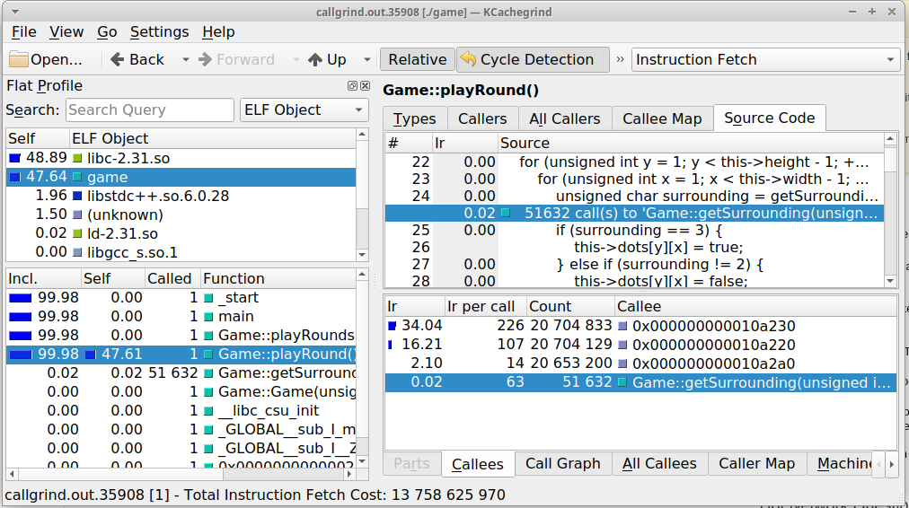
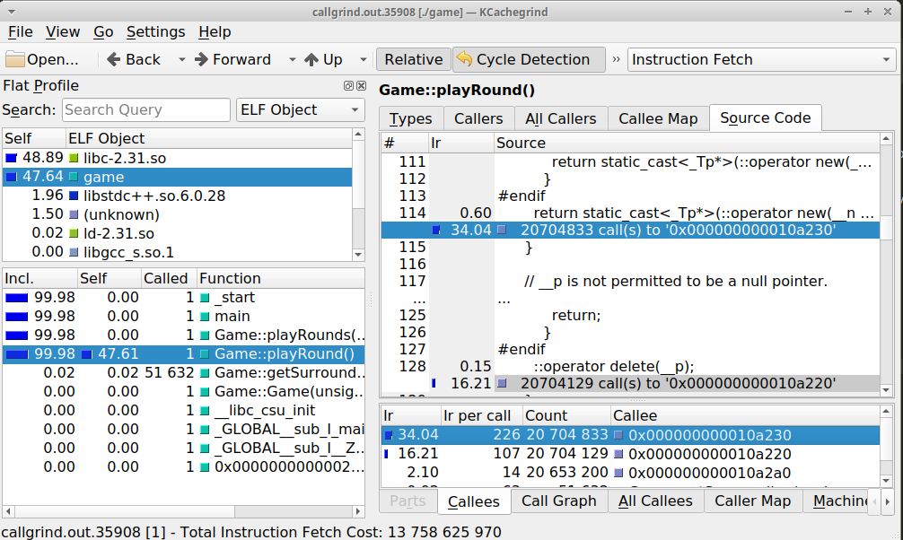
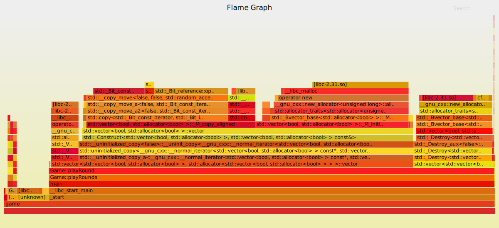

# Profiling

En este tutorial vamos a ver 2 formas de hacer un *profile* de nuuestra aplicación, es decir, de detectar cuellos de botella.

Para esto utilizaremos, en la primer forma, *valgrind* para generar un profile, y *kcachegrind* para visualizarlo.

Luego veremosm, como alternativa, la herramienta *perf*, que puede visualizarse con *FlameGraph* (entre otros).

## Ejemplo: juego de la vida

Creamos una aplicación que tiene implementado el motor del el famoso *Juego de la vida* de Conway.

Tenemos una clase Game, que posee un vector de vectores de variables tipo bool para representar cada celda del juego. Instanciamos nuestro juego pasándole un ancho y un alto, y luego llamamos a `playRounds`, al que le paso una cantidad grande de rondas para poder realizar la prueba de performance.

También poseemos un método para cambiar el estado de las celdas, pero no es necesario para este tutorial

**Nota**: las pruebas de performance pueden variar mucho entre distintas computadoras, se recomienda ajustar la cantidad de rondas a simular según a algo que represente un trabajo significativo para la pc pero que no termine inmediatamente ni que demore demasiado tiempo.

## Compilar el programa

Para poder realizar las mediciones eficientemente nos conviene compilar *optimizado y con información de debug*, es decir, con los flags `-g` y `-O2`. Una optimización mayor dificultaría el seguimiento de las funciones, mientras que una optimización menor no reflejaría el comportamiento de una versión "productiva".

Comenzamos en la versión 1 de nuestro código. Creamos una carpeta `build` y dentro de la misma ejecutamos `cmake ..` para que genere el Makefile. Finalmente ejecutamos `make`.

##  Ejecución

### Medición de tiempo

Primero ejecutamos nuestro juego con el comando `time`. Por ejemplo, ejcutando `time ./game`, eligiendo 20 rondas de un tablero de 300x300 me da una salida de 3 lineas como la siguiente:

~~~
real 0m18,599s
user 0m5,681s
sys	 0m0,001s
~~~

El tiempo `real` es el tiempo del "reloj de pared", la cantidad de segundos de tiempo real que estuvo en ejecución nuestra aplicación.

El tiempo `user` es el tiempo consumido de consumo de cpu de nuestra cpu. Lo curioso de este tiempo es que es la suma de cada nucleo por separado. Es decir, si nuestra aplicación estuvo corriendo 5 segundos utilizando 4 cpus, el tiempo `user` es de 20 segundos.

En este caso el tiempo es de CPU es de 5.6 segundos pese a que la aplicación estuvo corriendo 18.6 segundos. esto es debido a que estuvo 13 segundos esperando una entrada por prompt.

Por último, el tiempo `sys` es tiempo que la aplicación pasa haciendo syscalls.

### Generación de reporte

Ejecutamos la aplicación, pero utilizando valgrind. Lo invocamos de la siguiente manera

~~~
valgrind --tool callgrind ./game
~~~

Elegimos un tamaño número de vueltas no muy grande (en mi caso con 10 rondas en un tablero de 400 x 400 ya consume suficiente CPU como para hacer profiling, y para valgrind ya es demasiado). Al finalizar la ejecución se genera un archivo `callgrind.<pid>`.

## Analisis del reporte

Abrimos el reporte con `kcachegrind`. El programa debería mostrar información similar a la siguiente:

Podemos ver que esta herramienta tiene un buscador de funciones, un criterio de agrupamiento (por default es "Ninguno", pero recomiendo por ELF object).

Esta agrupación nos da un dato interesante: casi la mitad del tiempo nuestro programa está ejecutando código nuestro, de *game*, el resto del tiempo es consumido en gran parte por *libc*.

Cuando seleccionamos nuestra aplicación vemos que las funciones más significativas son justamente la de playRounds y playRound. Esto no es de extrañar por lo simple que es nuestro programa. Pero podemos hacer un analisis más profundo.

Seleccionamos playRound, que es la que mayor tiempo tiene de ejecución (lo vemos por el valor de *Self*). Vamos a la solapa *source code*, y como tenemos información de debug podemos ver qué se ejecuta. Debido a que tenemos óptimizaciones activadas, algunas funciones se hacen *inline*. Sin embargo, como dato curioso, podemos ver que el 34% del tiempo lo pasa con un *callee* anónimo y el 16 con otro muy cercano.

Hacemos click sobre el de 34% y vemos que es una llamada del operador `new`, el otro 16% corresponde al `delete`. ¡La mitad del tiempo está reservando y liberando memoria!

Empezamos pasando la matriz por referencia, ya que se podrían estar realizando copias por cada llamada a `getSurrounding`.

Pasamos la matriz de puntos y la mejora es instantanea. ¡De un promedio de 5.6 segundos pasamos a 0.0013 segundos!

# Profiling con perf y flamegraph

`perf` es otra herramienta para hacer *profiling*, que viene en el paquete `linux-tools-common`. Una cosa particular de esta herrramienta es que la versión instalada debe ser igual a la del kernel sobre el que está corriendo el sistema operativo.

## Instalación y ejecución de perf

Una vez instalado ejecutamos

~~~
perf record ./game
~~~

Lo más probable es que nos tire errores de privilegio, indicando que tenemos nivel de seguridad 3 en `/proc/sys/kernel/perf_event_paranoid`. Esto se arregla sencillo:

~~~
sudo sh -c 'echo 1 >/proc/sys/kernel/perf_event_paranoid'
~~~

O sinó también ejecutando

~~~
sudo sysctl -w kernel.perf_event_paranoid=1
~~~

### Visualización rápida

Podemos llamar a `perf report` para ver un resumen sencillo de los datos que tomamos. No es un resumen muy explicativo, pero es bastante rápido.

## Instalación de Flamegraph

`FlameGraph` originalmente fue una herramienta hecha en perl para generar unas imágenes `svg` con una hermosa visualización en forma de barras apiladas.

La misma se puede descargar desde [acá](https://github.com/brendangregg/FlameGraph). En este caso recomiendo seguir con el siguiente tutorial externo: https://nanxiao.me/en/use-perf-and-flamegraph-to-profile-program-on-linux/

Por otro lado, esta herramienta tuvo muy buena aceptación en la comunidad de **Rust**, motivo por el cuál se realizó un port de esta misma herramienta. La misma se puede instalar ejecutando

~~~
cargo install flamegraph
~~~

La ventaja de `flamegraph-rs` es que no sólo es más fácil de configurar, porque cargo se encarga de agregarla a nuestro path, sino que también combina la funcionalidad de todos los scripts de perl realizados en la versión original. Por este motivo es mucho más fácil de utilizar.

Con sólo ejecutar `flamegraph ./game`, esta versión de `flamegraph` llamará a `perl` y realizará la creación de la imagen *svg* automáticamente.

# Bibliografía

* https://valgrind.org/docs/manual/cl-manual.html

* https://nanxiao.me/en/use-perf-and-flamegraph-to-profile-program-on-linux/

* https://github.com/flamegraph-rs/flamegraph